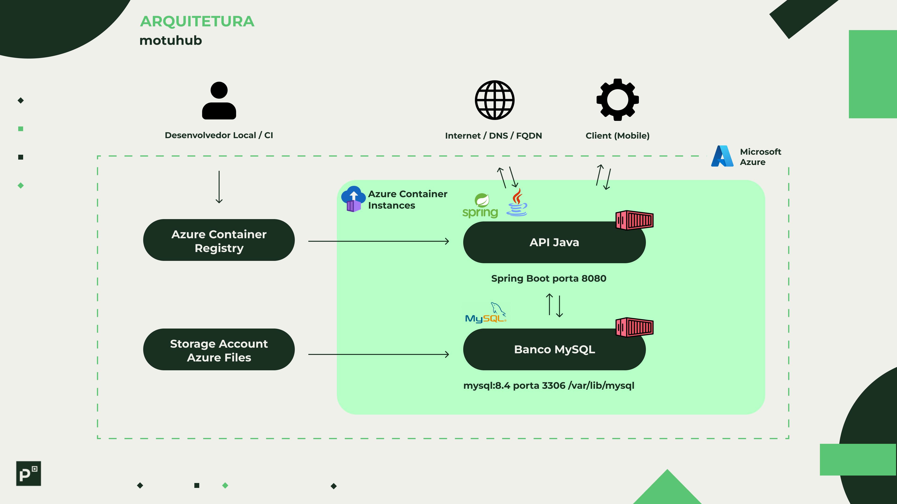

# Motohub – DevOps (ACR + ACI)

Entrega da disciplina **DevOps Tools & Cloud Computing** usando **Java (Spring Boot)**, **Docker (não-root)**, **Azure Container Registry (ACR)** e **Azure Container Instances (ACI)** com **MySQL em container** (persistência em **Azure Files**).

## 📌 Descrição da solução
**Motohub** é um **gestor de estoque de motos** desenvolvida para a empresa **Mottu**.  
A aplicação disponibiliza uma **API REST** para cadastrar, consultar, atualizar e excluir motos (CRUD), facilitando a **organização e localização** do estoque. O desenho prevê **integração com app mobile** e **dispositivos IoT** (por exemplo, telemetria), que consomem a API.

Principais endpoints:
- `GET /api/motos` — lista motos
- `POST /api/motos` — cadastra moto
- `GET /api/motos/{id}` — detalhe
- `PUT /api/motos/{id}` — atualiza
- `DELETE /api/motos/{id}` — exclui

## 💼 Benefícios para o negócio
- **Agilidade operacional:** localização rápida das motos pelo app/IoT via API centralizada.
- **Confiabilidade do inventário:** menos erros manuais e visão atualizada do estoque.
- **Escalabilidade e simplicidade:** deploy containerizado (ACR + ACI) sem gerenciar VMs.
- **Resiliência de dados:** persistência do MySQL em **Azure File Share** (sobrevive a recriações).
- **Segurança operacional:** o container da aplicação Spring roda **sem privilégios (não-root)**.

---

## 🧱 Arquitetura 



---

## 🗂️ Estrutura do repositório (resumo)

```
app/                          # Código Java (Spring Boot)
  docker/entrypoint.sh        # Espera MySQL e inicia a app (não-root)
  Dockerfile                  # Multi-stage, base oficial Temurin 17
infra/
  .env.example                # Variáveis de ambiente (copiar para .env)
  variables.sh                # Carrega .env e imprime variáveis
  00_register_providers.sh    # registra resource providers na assinatura
  01_rg.sh                    # Cria Resource Group
  02_storage.sh               # Cria Storage Account + File Share + .storage_secrets
  02b_mysql_apply_ddl.sh      # Aplica DDL dentro do container MySQL
  02c_mysql_test.sh           # Teste rápido do MySQL (SELECT 1, SHOW TABLES)
  03_acr_create.sh            # Cria ACR (admin enabled)
  04_build_push.sh            # Build local + push para o ACR
  05_aci_up.sh                # Renderiza YAML e cria o Container Group (polling + logs)
  06_print_url.sh             # Imprime a URL pública da API
  mysql_aci.yaml              # Template do Container Group (API + MySQL)
  teardown.sh                 # Remove o Resource Group
script_bd.sql                 # DDL comentada (se não usar só Flyway)
tests/
  curl-moto.sh                # Bateria de testes CRUD da entidade Moto
  curl-intencao.sh            # (opcional) Bateria CRUD de Intenção
comandos.txt                  # Comandos básicos para rodar os scripts
```

---

## ⚙️ Pré-requisitos

- **Azure CLI** autenticado (`az login`) e com a **assinatura correta** selecionada.
- **Docker** instalado e rodando (para build local).
- **Permissão** na assinatura para criar RG/ACR/ACI/Storage.

---

## 🔐 Variáveis de ambiente (copiar `infra/.env.example` → `infra/.env`)

Exemplo (ajuste nomes/forças de senha):

```bash
AZ_LOCATION="brazilsouth"
AZ_RG="rg-motohub"
AZ_RM="RM558883"

ACR_NAME="motohubrm558883acr"

STG_NAME="stmotohubrm558883"
STG_SKU="Standard_LRS"
FILESHARE_NAME="fs-mysql"

MYSQL_IMAGE="mysql:8.4"
MYSQL_DB="motohub"
MYSQL_ROOT_PASSWORD="troque-essa-senha"
MYSQL_APP_USER="motohub"
MYSQL_APP_PASSWORD="troque-essa-senha-tbm"

APP_IMAGE_REPO="motohub-api"
APP_IMAGE_TAG="v1"
APP_PORT="8080"

SPRING_DATASOURCE_URL="jdbc:mysql://127.0.0.1:3306/${MYSQL_DB}?useSSL=false&allowPublicKeyRetrieval=true&serverTimezone=UTC"
SPRING_DATASOURCE_USERNAME="${MYSQL_APP_USER}"
SPRING_DATASOURCE_PASSWORD="${MYSQL_APP_PASSWORD}"
```

---

## 🚀 Provisionamento (passo a passo)

> Todos os comandos abaixo são executados a partir da raiz do repositório.

1) (Opcional, mas recomendado) **Registrar providers**  
```bash
./infra/00_register_providers.sh
```

2) **Criar Resource Group**  
```bash
./infra/01_rg.sh
```

3) **Criar Storage Account + File Share** (persistência do MySQL)  
```bash
./infra/02_storage.sh 
```

4) **Criar ACR**  
```bash
./infra/03_acr_create.sh
```

5) **Build & Push da imagem da API** (Docker local)  
```bash
./infra/04_build_push.sh
```

1) **Deploy do Container Group (ACI)** – API + MySQL + Azure Files  
```bash
./infra/05_aci_up.sh
```

1) **Descobrir URL pública da API**  
```bash
./infra/06_print_url.sh
# Ex.: http://motohub-rm558883.brazilsouth.azurecontainer.io:8080
```

1) **(Opcional) Aplicar DDL** (Somente se o Flyway estiver desabilitado)  
```bash
./infra/02b_mysql_apply_ddl.sh
./infra/02c_mysql_test.sh
```

---

## 🧪 Como testar (CRUD)

1) Exporte a URL base (conforme passo 7):  
```bash
export API_BASE="http://motohub-rm558883.brazilsouth.azurecontainer.io:8080"
```

2) Execute os scripts de teste:

```bash
./tests/curl-moto.sh

./tests/curl-intencao.sh
```

> Os scripts executam **POST → GET → GET por ID → PUT → DELETE → GET final**, imprimindo as respostas.  

---

## 🗃️ DDL (script_bd.sql)

- `script_bd.sql` contém a **DDL comentada** da(s) tabela(s) principais (ex.: `moto`).  
- Você pode aplicar via `infra/02b_mysql_apply_ddl.sh` ou deixar a **migrations Flyway** cuidar disso automaticamente (recomendado).

---

## 🔒 Segurança & conformidade da entrega

- **Imagens oficiais:** `eclipse-temurin:17-jre` (runtime) e `mysql:8.4` (DB).  
- **Não-root:** a API executa como usuário **`app`** (confira no log: `Starting Motohub as UID=...`).  
- **Banco não exposto publicamente:** somente a **porta 8080** da API é pública; o MySQL fica acessível apenas dentro do grupo.  
- **Persistência real:** `/var/lib/mysql` montado em **Azure File Share** (dados sobrevivem a recriações).

---

## ❗ Solução de problemas (FAQ rápido)

- **API não sobe / “Communications link failure”**  
  Garanta que:
  - `SPRING_DATASOURCE_URL` usa **127.0.0.1:3306**,  
  - espere o MySQL (o `entrypoint.sh` já faz `mysqladmin ping`),  
  - a imagem foi **rebuildada** e **pushada** com **nova tag** (ex.: `v2`) e o YAML aponta para ela.

- **ACI não mostra logs / “ContainerGroupDeploymentNotReady”**  
  Aguarde o polling do `05_aci_up.sh` e/ou rode:
  ```bash
  az container show -g "$AZ_RG" -n "motohub-<rm>" --query "containers[].instanceView.events" -o jsonc
  ```

- **Build falha por Docker local**  
  Alternativa: usar **GitHub Actions** para build & push no ACR (workflow de `docker/build-push-action`).
